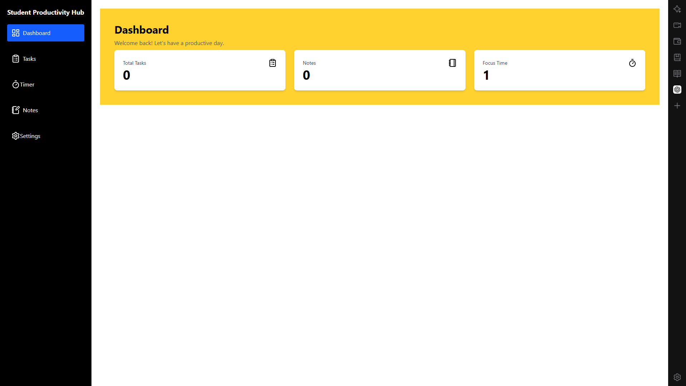
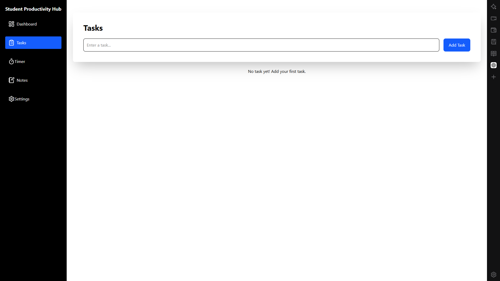
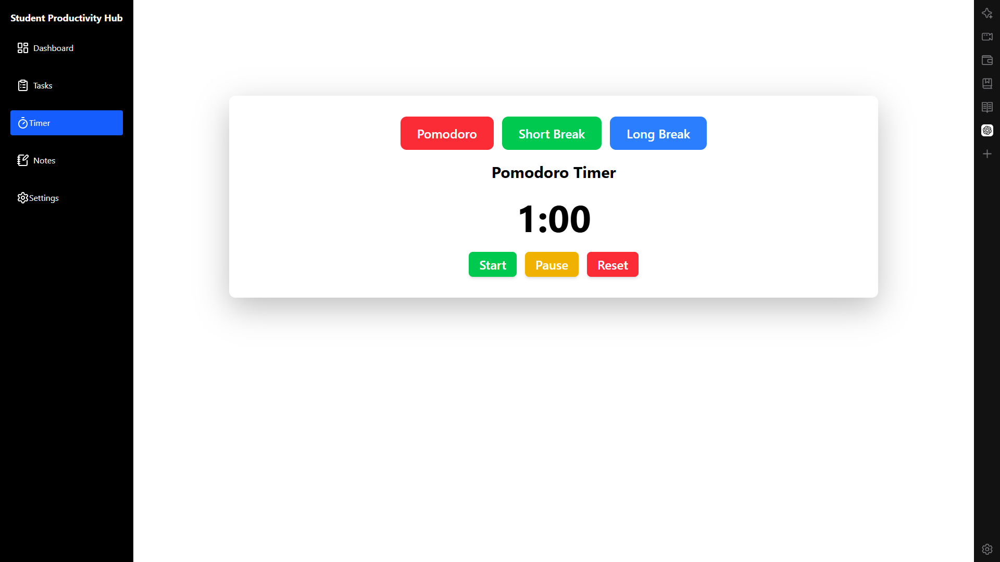
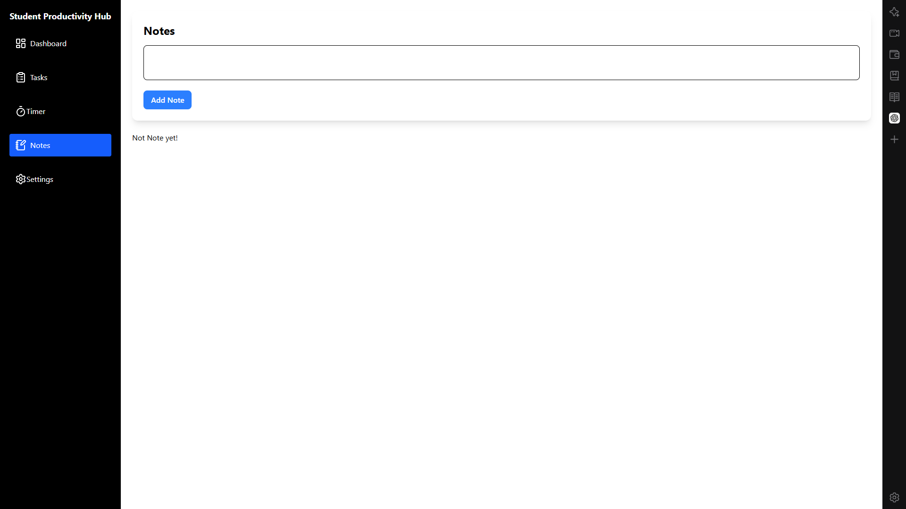
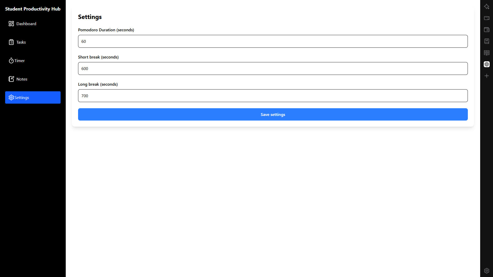

# Student Productivity Hub

## Description
The student productivity is a website that helps student manage their study work in website.The student can add notes,use timer for study,can add notes and tasks also and  all the total task,totoal notes,totalTime of the student also visible in the dashboard.

## features
* you can delete tasks.
* you can mark tasks as complted when you finish the task.
* your aall the task are saved in localstorage.
* you can acces your all task even after closing website.
* you can save notes when you need to remember somthing.
* there is pomodoro timer also to help you study.
* you can take short break and long break with the timer.
* you can change the timer settings according to your need.
* everything you changed there and save there save in localstorage.

## Why i Built This
 i built the student productivity Hub because students use different website for the tasks, notes and study timers. i  wanted to put some of the things that student need frequently in one place . i alsoe built this website because iam learning react and i wanted to make a project with the current skill of my react .while making this project i learned more about react state, useEffect, localstorage and useref.

 ## How it works
 1. First you open the website.
 2. Then you add your tasks from the task section.
 3. you can make your task complte or delete also when you done your task.
 4. you can add notes when you need to save something short things.
 5. next you can open the timer and select the timer there like pomodoro short break or long break.
 6. you can click the statrt button when you want to start studying.
 7. you can use the reset timer if you need.
 8. your task notes timer data are saved using localstorage so you can get them later also .

 ## How to Run 
 1. First you clone this project.
 2. Then you open the project folder in the vs code.
 3. you install the required package by running this command:``` npm install ```
 4. next you start the server by running this command:``` npm run dev ```
 5.now you can open the website in your browser.

## Screenshots






 ## AI Usage
 i used Chatgt to remember some react and javascript concepts that i alredy learned but somehow forgot. i also used it to help me debug when i was stuck with some errors continiously. I tested the code myself and used ai mainly when i needed help understanting and debugging something.

 ## what i learned
 * i learned about usestate. how it changed the ui in render.
 * i learned how useeffect works and how to use it .
 * i feel confidence now to use localstoreage with react to save data.
 * i learned useref can store the time interval.
 * i learned how to make componenets and manage their states perfectly.
 * i leaned about desing with tailwindcss.

 ## future improvements
 * i want to make the sidebar fully working.
 * i want to make it responsive so it looks better on smaller screen.
 * i want to add useful statistics for study progress so student can see how they are doing.